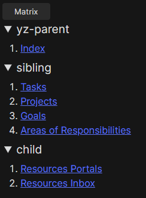
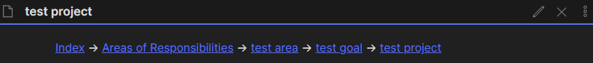

<b>
☪Breadcrumb
</b>
**说明**

**教程**
- [在obsidian中实现笔记层级 (breadcrumbs插件介绍)](https://www.bilibili.com/video/BV1KL411s7bX)

# Breadcrumb Trail

这个插件为Obsidian添加了多个新视图。

### [wiki](https://github.com/SkepticMystic/breadcrumbs/wiki)有更多关于插件的深入信息比过时的自述。

你可以在这里找到更新日志(https://github.com/SkepticMystic/breadcrumbs/blob/master/CHANGELOG.md)。

## 基础知识

面包屑可以让你在笔记中添加分层元数据，然后利用这种结构。
使用上(↑)、上(→)、下(↓)的关系，可以在笔记中添加方向性结构。

## Matrix/List view

该视图以下列任一样式显示当前注释的父级、兄弟级和子级:

要打开侧边栏中的视图，从命令面板中运行命令' Breadcrumbs: open view '。

## Breadcrumbs Trail view

This view shows a trail of notes from the top of your vault down to your current note

为了获得这种结构，插件要求您使用某种类型的元数据来指示注释的层次结构。
例如，您可能有一个名为' parent '的yaml字段，它链接到当前注释的"parent"注释:' parent: [[parent note]] '。(您也可以使用内联Dataview字段' parent:: [[parent Note]] ')。
使用这个结构，您可以使用breadcrumb跟踪来可视化返回到父笔记的路径。

## 喂我的咖啡
如果你愿意的话，可以请我在这里喝杯咖啡:https://ko-fi.com/skepticmystic:)
