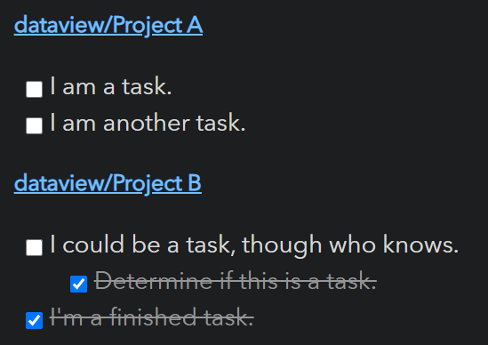

<b><center><span style="font-family:default; font-size:28; color:blue">☪插件Dataview</span></center></b>

**教程**
- Dataview 官方API详细说明   
[Dataview-API详细说明](document/intro.md)   
- 下方是官方代码Readme文档


# Obsidian Dataview

将您的[Obsidian Vault](https://obsidian.md/)作为您可以查询的数据库。提供一个JavaScript API和基于管道的查询语言，用于从Markdown页面中过滤、排序和提取数据。参见示例部分下面是一些简单的例子，或者是完整的参考文献(https://blacksmithgu.github.io/obsidian-dataview/)。

## Examples

显示游戏文件夹中的所有游戏，按评级排序，带有一些元数据:

~~~markdown
```dataview
table time-played, length, rating
from "games"
sort rating desc
```
~~~


---

列出moba或crpg游戏。

~~~markdown
```dataview
list from #game/moba or #game/crpg
```
~~~


---

列出未完成项目中的所有任务:

~~~markdown
```dataview
task from #projects/active
```
~~~



---

显示你在2021年读过的“书”文件夹中的所有文件，按类型和评级进行分组:

~~~markdown
```dataviewjs
for (let group of dv.pages("#book").where(p => p["time-read"].year == 2021).groupBy(p => p.genre)) {
	dv.header(3, group.key);
	dv.table(["Name", "Time Read", "Rating"],
		group.rows
			.sort(k => k.rating, 'desc')
			.map(k => [k.file.link, k["time-read"], k.rating]))
}
```
~~~


## Usage

有关所有功能、说明和示例的完整描述，请参阅(参考)(https://blacksmithgu.github.io/obsidian-dataview/)。为了得到一个更简单的大纲，让我们来看看这两个主要方面数据视图的方面:*数据*和*查询*。

#### **数据**

Dataview通过拉动生成*data*信息来自**Markdown frontmatter**和**Inline fields**。

- Markdown frontmatter是任意的YAML，在可以存储元数据的Markdown文档的顶部用'——'括起来关于这个文档。
-内联字段是一个数据视图功能，允许您直接内联写入元数据的markdown文档
  `Key:: Value` 语法。

以下是两个例子:

```yaml
---
alias: "document"
last-reviewed: 2021-08-17
thoughts:
  rating: 8
  reviewable: false
---
```
```markdown
# Markdown Page

Basic Field:: Value
**Bold Field**:: Nice!
```

#### **查询**

一旦用元数据注释了文档等，就可以使用Dataview的四个查询中的任何一个进行查询
模式:

1. **数据视图查询语言(DQL)**:一种基于管道的，模糊的sql外观的表达式语言，可以支持基本的
用例。详情请参阅[文档](https://blacksmithgu.github.io/obsidian-dataview/query/queries/)。

   ~~~markdown
   ```dataview
   TABLE file.name AS "File", rating AS "Rating" FROM #book
   ```
   ~~~

2. **内联表达式**:DQL表达式，你可以直接嵌入markdown，并将在其中计算预览模式。参见[文档](https://blacksmithgu.github.io/obsidian-dataview/query/expressions/)允许查询。

   ```markdown
   We are on page `= this.file.name`.
   ```

3. **DataviewJS**:一个高性能的JavaScript API，它提供了对Dataview索引的完全访问和一些方便

渲染工具。如果您了解JavaScript，强烈推荐，因为它比查询功能强大得多

语言。查看[文档](https://blacksmithgu.github.io/obsidian-dataview/api/intro/)了解更多细节。

   ~~~markdown
   ```dataviewjs
   dv.taskList(dv.pages().file.tasks.where(t => !t.completed));
   ```
   ~~~

4. **内联JS表达式**:JavaScript的内联表达式，它允许你执行任意的JS
内联:

   ~~~markdown
   This page was last modified at `$= dv.current().file.mtime`.
   ~~~

## 贡献

通过错误报告、错误修复、文档和一般改进的贡献总是受欢迎的。更主要的功能工作，提出关于功能想法的问题/联系我，这样我们就可以判断可行性以及如何最好地实现实现它。

#### 当地发展

代码库是用TypeScript编写的，使用' rollup ' / ' node '进行编译;第一次准备，全是你应该需要做的是拉，安装，和构建:

```console
foo@bar:~$ git clone git@github.com:blacksmithgu/obsidian-dataview.git
foo@bar:~$ cd obsidian-dataview
foo@bar:~/obsidian-dataview$ npm install
foo@bar:~/obsidian-dataview$ npm run dev
```

这将安装库，构建数据视图，并部署到' test-vault '，然后你可以在Obsidian中打开它。这也将把' rollup '在监视模式，所以任何更改的代码将重新编译和测试库将自动重新加载。

####安装到其他金库

如果你想在真实的保险库中dogfood数据视图，你可以手动构建和安装:

```console
foo@bar:~/obsidian-dataview$ npm run build
foo@bar:~/obsidian-dataview$ ./install-built.sh path/to/your/vault
```

#### 构建文档

我们使用' MkDocs '表示文档(可以在' docs/ '中找到)。你需要python和pip在本地运行它:

```console
foo@bar:~/obsidian-dataview$ pip3 install mkdocs mkdocs-material mkdocs-redirects
foo@bar:~/obsidian-dataview$ cd docs
foo@bar:~/obsidian-dataview/docs$ mkdocs serve
```

这将启动一个本地web服务器在' docs/docs '中渲染文档，它将在更改时实时重新加载。文档更改会自动推送到“blacksmithgu.github”。Io /obsidian-dataview '到主分支去。

####在自己的插件中使用数据视图类型

Dataview将其所有api的TypeScript类型发布到NPM上(比如' blacksmithgu/obsidian-dataview ')。为关于如何使用Dataview设置开发的说明，请参见[设置说明](https://blacksmithgu.github.io/obsidian-dataview/plugin/develop-against-dataview/)。

## 支持

您是否发现Dataview插件有用，并希望支持它?我接受用于未来的捐款开发工作。我通常不接受漏洞奖励或功能请求的报酬，因为这是出于经济动机压力/期望，我想避免的爱好项目!

[](https://www.paypal.com/donate?business=Y9SKV24R5A8BQ&item_name=Open+source+software+development&currency_code=USD)
