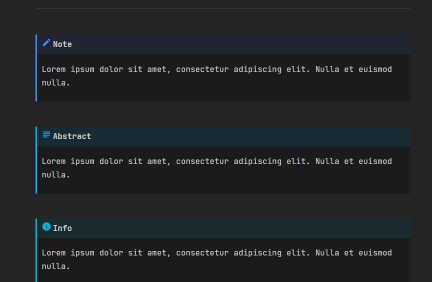
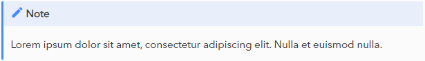
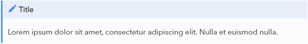
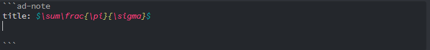
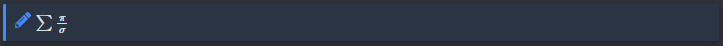
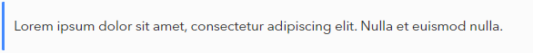
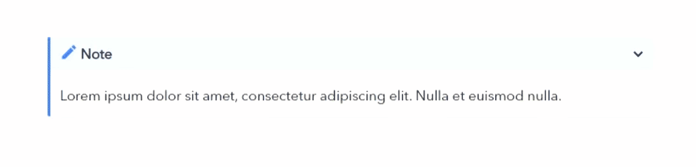
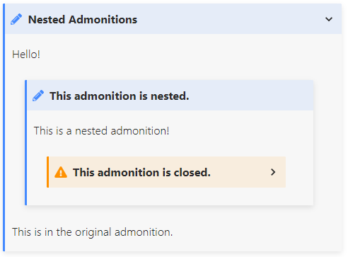
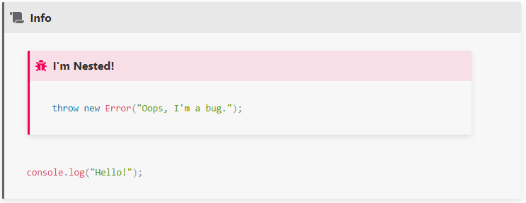

# Obsidian Admonition

增加警告块风格的内容到黑曜石。医学博士风格的后 [材料MkDocs](https://squidfunk.github.io/mkdocs-material/reference/admonitions/)

**请注意，从2.0.0开始，所有警告都必须加上前缀 `ad-`**



## 使用

放置一个带有警告类型的代码块:

````markdown
```ad-note
他们悲伤地坐着，安慰着他们。什么都没有，什么都没有。
```
````

就变成:



## 选项

````markdown
```ad-<type> # 警告类型。参见下面的可用类型列表。
title:                  # 警告标题。
collapse:               # 创建一个可折叠的警告。
icon:                   # 覆盖的图标。
color:                  # 覆盖的颜色。

他们悲伤地坐着，安慰着他们。什么都没有，什么都没有。

```
````

请注意，从**4.4.1**开始，“title”、“collapse”、“icon”和“color”参数必须以任意顺序位于区块的顶部。

### 标题

默认情况下，警告将以警告类型呈现。如果你想自定义标题，你可以这样做:

````markdown
```ad-note
title: 标题

他们悲伤地坐着，安慰着他们。什么都没有，什么都没有。
```
````



自定义标题呈现为Markdown，所以它们支持完整的Obsidian Markdown语法。





将标题字段留空，只显示警告。

````markdown
```ad-note
title:
他们悲伤地坐着，安慰着他们。什么都没有，什么都没有。
```
````



### 可折叠的
使用`collapse`参数创建一个可折叠的警告。

`collapse: open` 会在渲染时打开警告，但允许在点击时崩溃。

如果提供了一个空白标题，则collapse参数不会做任何事情。

警告可以在设置中默认设置为可折叠。



### 图标

可以使用' icon '参数覆盖警告图标。**输入的图标名称必须是确切的图标名称从FontAwesome或RPGAwesome

````
```ad-note
icon: triforce

他们悲伤地坐着，安慰着他们。什么都没有，什么都没有。
```
````

### 颜色

可以使用' color '参数覆盖警告颜色。**输入的颜色必须是RGB三极管**

````
```ad-note
color: 200, 200, 200

他们悲伤地坐着，安慰着他们。什么都没有，什么都没有。

```
````

### 没有内容

没有内容的警告将显示为标题块。

````
```ad-note
```
````

## 嵌套警告

嵌套警告可以通过增加反勾的数量来实现。

例子:

``````
`````ad-note
title: 嵌套的警告
collapse: open

Hello!

````ad-note
title: 这个警告是嵌套的。

这是一个嵌套的警告!

```ad-warning
title: 此警告关闭。
collapse: close
```

````

这是最初的告诫。
`````
``````

警告也可以使用[Python Markdown](https://python-markdown.github.io/extensions/admonition/)语法相互嵌套。

> :warning: **Please note that this syntax _cannot_ be used for the original admonition. It must be a codeblock (```).**

例子:

````
```ad-note
title: Nested Admonitions
collapse: open

Hello!

!!! ad-note
	title: This admonition is nested.
	This is a nested admonition!
	!!! ad-warning
		title: This admonition is closed.
		collapse: close


This is in the original admonition.
```
````



## 在警告中呈现代码块

代码块可以使用类似于上面的[嵌套警告](#嵌套警告)的方法嵌套在警告中。
此外，对于单个层，可以使用' ~~~ ' markdown代码块语法:

`````
````ad-info

```ad-bug
title: I'm Nested!
~~~javascript
throw new Error("Oops, I'm a bug.");
~~~
```

```javascript
console.log("Hello!");
```

````
`````



## 警告类型

目前支持以下警告类型:

| Type     | Aliases                     |
| -------- | --------------------------- |
| note     | note, seealso               |
| abstract | abstract, summary, tldr     |
| info     | info, todo                  |
| tip      | tip, hint, important        |
| success  | success, check, done        |
| question | question, help, faq         |
| warning  | warning, caution, attention |
| failure  | failure, fail, missing      |
| danger   | danger, error               |
| bug      | bug                         |
| example  | example                     |
| quote    | quote, cite                 |

参见[this](https://squidfunk.github.io/mkdocs-material/reference/admonitions/)，以获得这些警告的参考。

通过创建同名的用户定义警告，可以自定义默认警告。

## 自定义警告

可以在设置中创建自定义警告。

创建一个新的警告需要三样东西:类型、要使用的图标和警告的颜色。

在任何时候，每种类型的警告只能存在一次;如果创建了另一个相同类型的警告，它将覆盖前面创建的警告。

如果覆盖了默认警告，可以通过删除自定义警告恢复默认警告。

请注意，默认情况下，标题的背景颜色只是警告的颜色，不透明度为10%。必须使用CSS进行更新。

### 图像作为图标

图像可以上传使用作为一个警告图标，而不是一个图标从字体Awesome或RPG Awesome。

这些图像的大小将被调整为24px x 24px，以存储在插件的保存数据中。

要删除图像图标，只需在图标选择器文本框中选择一个图标。

## 定制

这是所有应用于警告的CSS。重载这些类以自定义外观。

### 基类

完整的CSS位于[main.css](src/assets/main.css)。

每个警告都会收到以下CSS类:

```css
:root {
    --admonition-details-icon: url("data:image/svg+xml;charset=utf-8,<svg xmlns='http://www.w3.org/2000/svg' viewBox='0 0 24 24'><path d='M8.59 16.58L13.17 12 8.59 7.41 10 6l6 6-6 6-1.41-1.42z'/></svg>");
}

.admonition {
    margin: 1.5625em 0;
    padding: 0;
    overflow: hidden;
    color: var(--text-normal);
    page-break-inside: avoid;
    background-color: var(--background-secondary);
    border-left: 0.2rem solid rgb(var(--admonition-color));
    border-radius: 0.1rem;
    box-shadow: 0 0.2rem 0.5rem var(--background-modifier-box-shadow);
}

.admonition-title {
    position: relative;
    padding: 0.6rem 0.25em;
    font-weight: 700;
    background-color: rgba(var(--admonition-color), 0.1);
}

.admonition-title-content {
    display: flex;
    justify-content: flex-start;
    margin-top: 0 !important;
    margin-bottom: 0 !important;
}

.admonition-title-icon {
    color: rgb(var(--admonition-color));
    display: flex;
    align-items: center;
    justify-content: center;
    margin: 0 0.5em 0 0.25em;
    min-width: 1em;
}

.admonition-title-markdown {
    display: block;
}

.admonition-title.no-title {
    display: none;
}

.admonition > .admonition-title.no-title + .admonition-content-holder {
    margin-top: 1rem;
    margin-bottom: 1rem;
}

.admonition-content-holder {
    position: relative;
}

.admonition-content {
    margin: 10px 15px;
    position: relative;
    overflow-x: auto;
}

.admonition-content-copy {
    color: var(--text-faint);
    cursor: pointer;
    opacity: 0;
    position: absolute;
    right: 0.375rem;
    top: -5px;
    transition: 0.3s opacity ease-in;
}

.admonition-content-copy:hover {
    color: var(--text-normal);
}

.admonition:hover .admonition-content-copy,
.admonition-content-copy:hover {
    opacity: 1;
}
.admonition-title:hover + .admonition-content .admonition-content-copy {
    opacity: 0;
}
```

**请注意，从3.0.0起，警告颜色不再设置在CSS.**中

每次警告都会收到“。警告——< >类型的类。你可以使用这个选择器来覆盖特定的警告类型，但是插件默认情况下不会使用这个选择器添加任何样式。

要通过CSS设置警告类型的颜色，指定以下`——warnings -color`变量** _为RGB triad_**:

```css
.admonition-note {
    --admonition-color: 68, 138, 255 !important;
}
```

### 可折叠的

如果警告是可折叠的，它将收到以下CSS:

```css
details.admonition:not([open]) {
    padding-bottom: 0;
    box-shadow: none;
}

details.admonition > summary {
    outline: none;
    list-style: none;
    display: block;
    min-height: 1rem;
    border-top-left-radius: 0.1rem;
    border-top-right-radius: 0.1rem;
    cursor: pointer;
}

details.admonition > summary::-webkit-details-marker {
    display: none;
}

details.admonition > summary > .collapser {
    position: absolute;
    top: 50%;
    right: 8px;
    transform: translateY(-50%);
    content: "";
}

details.admonition > summary > .collapser > .handle {
    transform: rotate(0deg);
    transition: transform 0.25s;
    background-color: currentColor;
    -webkit-mask-repeat: no-repeat;
    mask-repeat: no-repeat;
    -webkit-mask-size: contain;
    mask-size: contain;
    -webkit-mask-image: var(--admonition-details-icon);
    mask-image: var(--admonition-details-icon);
    width: 20px;
    height: 20px;
}

details.admonition[open] > summary > .collapser > .handle {
    transform: rotate(90deg);
}
```

### 无标题

一个没有标题的图标会有这样的CSS:

```css
.admonition-title.no-title {
    display: none;
}
```

## 全球的命令

默认情况下，插件有几个命令可用。

### 折叠并打开所有注释中的警告

如果这两个命令用一个打开的注释触发，所有可折叠的警告将分别被折叠或打开

<!-- ### 用HTML代替警告

用注释内容中呈现的HTML替换_all_警告源块。

此命令将覆盖开注中的所有“警告”。 -->

### 插入警告


这将打开一个模式，其中可以设置警告类型、标题和折叠行为，然后将生成的警告代码块插入到打开的编辑器中。

### Admonition-specific命令

可以为每种自定义警告类型注册命令，通过单击“注册命令”按钮将它们插入到一个开放的通知中。

请参阅[本节](#register-and-unregister-commands)了解更多信息。

## Non-code block Admonitions

从6.0.0版本开始，有一个新设置:启用非代码块警告。

这种设置是高度实验性的，可能不会像预期的那样工作，在本节的末尾列出了一些注意事项，请记住。

这种设置允许创建一个警告，而不将其包装在代码块中，这意味着链接和标签将同步到Obsidian的缓存中。非代码块警告可以使用以下语法创建:

```
!!! ad-<type> Title goes here!

content

--- admonition
```

这将创建适当的警告类型，嵌入内容，并给它提供标题。

### 标题

标题应该放在警告栏之后。目前，在标题中不支持降价。

空标题可以通过在警告类型后面放置两个空格来创建:

```
!!! ad-<type>

content

--- admonition
```

或者通过放置空双引号:

```
!!! ad-<type> ""

content

--- admonition
```

### 可折叠的

可以使用以下语法创建一个可折叠的警告:

```
??? ad-<type> Title goes here!

content

--- admonition
```

一个可折叠的警告可以通过添加一个+来默认为“open”:

```
???+ ad-<type> Title goes here!

content

--- admonition
```

### 警告

1. 呈现后对警告的更改需要清除缓存。该笔记必须关闭和重新打开(有时，必须首先打开不同的笔记)。

1. 这是_全部更改，包括警告类型、标题、内容，甚至可折叠警告最初是打开还是关闭。

2. 嵌套警告目前不支持。

如果你在使用这个设置时遇到任何错误，请创建一个问题，我将调查他们。

## 设置

### 语法高亮显示

打开一个实验模式，在警告代码块内使用Obsidian的markdown语法高亮显示。

### 同步链接到元数据缓存

这将尝试在警告内同步内部链接到Obsidian使用的元数据缓存。这将允许图形视图显示这些链接。

这种设置是实验性的，可能会产生意想不到的后果。如果你开始体验奇怪的行为，试着关掉它并重新加载Obsidian。

### 启用非代码块警告

允许使用非代码块警告，在这里描述[这里](#非代码块警告)。

### 可折叠的默认情况下

默认情况下，警告将自动呈现为可折叠(打开)。

如果设置了，在警告块中使用`collapse: none`来覆盖。

### 默认折叠类型

**此设置仅在可折叠默认为开启时可用**

默认情况下，当可折叠时，警告将自动呈现为打开或关闭。

### 复制按钮

添加一个“复制内容”按钮到每个警告块。

### 注册和注销命令

可以为每种自定义警告类型注册命令，通过单击“注册命令”按钮将它们插入到一个开放的通知中。

单击此按钮将为该警告类型添加两个命令:

1. 插入<类型>

2. 插入带有标题的<类型>

这些命令可以在“设置>热键”下为它们分配热键。

可以通过点击“取消注册命令”来删除已注册的命令。

## 待办事项

目前没有计划增加其他功能。如果您想查看缺少的功能，请打开一个问题。

- [x]添加崩溃警告的能力

- [x]自定义警告

- [x]设置选项卡自定义图标和颜色的所有警告

-可以在警告中显示降价

# 版本历史

## 6.0.0

- 增加了不使用代码块定义警告的能力
- ——添加”。警告插件的类到顶级元素
- -添加命令“插入警告”与一个模式选择器
- -添加命令“用HTML替换警告”

## 5.0.0

-   添加[RPG Awesome Icons](http://nagoshiashumari.github.io/Rpg-Awesome/)作为警告图标的选项。

## 4.4.1

- 删除' content '参数
- 修正了一些与解决参数相关的问题

## 4.4.0

- 增加了注册和取消注册命令的能力，以插入警告到一个说明
	- 在设置中创建的警告可以通过点击新的“注册命令”按钮注册命令
	- 注册命令会增加两个命令:' Insert '和' Insert With Title '
	- 可以通过点击“取消注册命令”来删除已注册的命令

## 4.3.0

-   增加了“元数据缓存同步链接”设置

## 4.2.0

-  添加默认可折叠和默认折叠类型设置

## 4.1.5

-   改进了警告图标的选择体验

## 4.1.4

-   当复制到剪贴板时，裁剪内容中的空白。

## 4.1.0

- 增加了“复制按钮”设置
	- 打开这个添加一个“复制内容”按钮，每个警告，复制告诫内容到剪贴板
## 4.0.0

-   嵌套警告现在是可能的

## 3.3.0

- 增加了打开和折叠所有提示的命令
- 警告图标现在尊重警告标题的字体大小
- 折叠句柄现在集中在标题元素中
- CSS变化

## 3.2.0

- 增加了一个设置，打开默认的黑曜石语法高亮警告代码块类型
- 警告现在将标题渲染为Markdown

## 3.1.0

-   修正了警告中的复选框不能被切换的问题

## 3.0.0

- 增加了通过设置创建自定义警告的能力
- 颜色，图标和警告类型是可定制的
- 默认警告可以通过创建相同类型的自定义警告来覆盖
- 删除自定义警告，恢复默认设置

## 2.0.0

-为了保持与其他插件的兼容性，警告类型现在必须以“ad-”作为前缀(比如，“ad-note”)。

## 1.0.0

- 社区插件发布
- 错误修复

## 0.2.0

-使用黑曜石的本地降价渲染器渲染警告内容
-删除了在设置title:或collapse:时使用content:标签的要求

## 0.0.5

-   Added `collapse:` parameter to create collapsible admonitions

## 0.0.1

-   Release

# 安装

## 从黑曜石内部

在Obsidian v0.9.8中，你可以通过以下步骤激活这个插件:
- 打开设置>第三方插件
- 确保安全模式是**关闭**
- 单击“浏览社区插件”
- 搜索这个插件
- 点击安装
- 安装完成后，关闭社区插件窗口并激活新安装的插件

## 从GitHub

- 从GitHub存储库的Releases部分下载最新版本
- 将插件文件夹从zip文件中解压到vault的plugins文件夹中:' /.obsidian/plugins/ '
- 注意:在一些机器上。Obsidian '文件夹可能被隐藏。在MacOS上，你应该能够按“命令+Shift+点”来显示Finder中的文件夹。
- 重载黑曜石
- 如果提示安全模式，您可以禁用安全模式，并启用插件。
- 否则头到设置，第三方插件，确保安全模式关闭和
- 从那里启用插件。

### 更新

您可以按照相同的过程来更新插件

# 警告

这个插件没有稳定性的保证，bug可能会删除数据。

请确保您有自动备份。

# TTRPG plugins

If you're using Obsidian to run/plan a TTRPG, you may find my other plugin useful:

-   [Obsidian Leaflet](https://github.com/valentine195/obsidian-leaflet-plugin) - Add interactive maps to Obsidian.md notes
-   [Dice Roller](https://github.com/valentine195/obsidian-dice-roller) - Add some randomness to your notes
-   [Initiative Tracker](https://github.com/valentine195/obsidian-initiative-tracker) - Track TTRPG Initiative in Obsidian
-   [5e Statblocks](https://github.com/valentine195/obsidian-5e-statblocks) - 5e-style statblocks inside notes!

<a href="https://www.buymeacoffee.com/valentine195"></a>