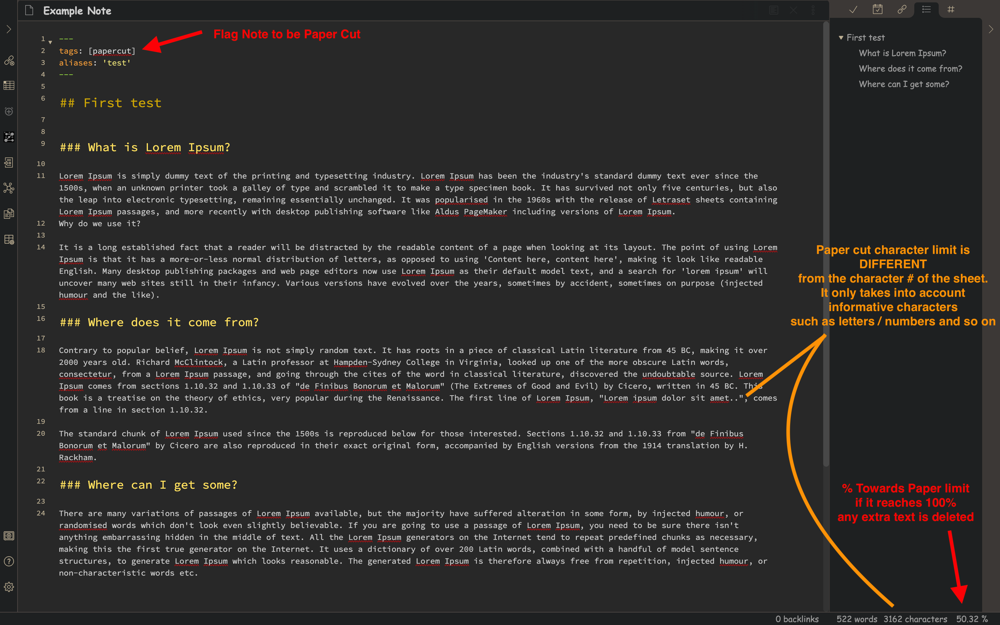

# Obsidian Papercut Plugin

Expressing an idea in the simplest and most concise way possible provides great benefits especially in a growing web of ideas.

Papercut plugin allows the user to set a `Paper Limit` that deletes any note content that exceeds that limit.

## Example

## Settings

## Support

 
